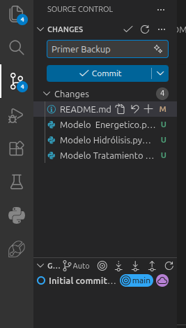
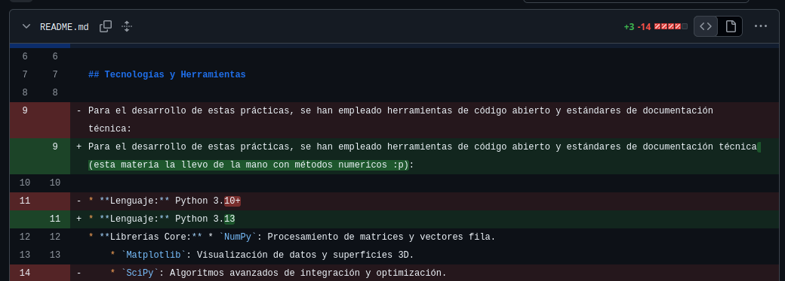
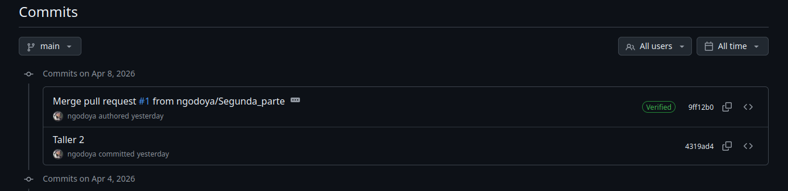
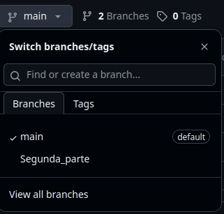
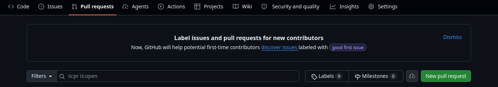
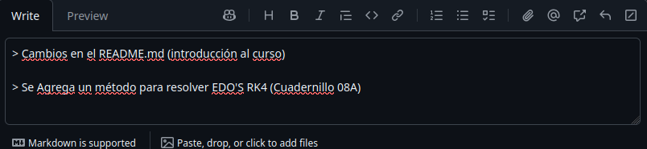

# Semillero Hidrogeno Verde

Este espacio esta enfocado para desarrollar, actualizar e informar sobre cualquier avance en el proyecto del semillero de hidrogeno verde.

---

# Cómo subo mis avances?

>[!tip]
Dejo una syntax de comandos  básicos para trabajar con Github, estos comandos se usan en la terminal de su entorno virtual (Recomiendo usar **VS Code**), cómo instalarlo? [Aquí](https://code.visualstudio.com/download)

```bash
# 1. traer repo
git clone URL

# 2. entrar al repo
cd repo

# 3. crear rama
git switch -c feature-nombre

# 4. guardar cambios
git add .

# 5. crear commit
git commit -m "descripcion corta"

# 6. subir cambios
git push
```

# Introducción

Github es una herramienta muy poderosa para el trabajo en equipo, más allá de los comandos que voy a anotar para enviar, recoger y comentar cambios, tiene mucho potencial para incluso revisar y administrar que cambios se suben al proyecto final.

Para utilizar Github en Windows (Aunque lo recomendable es que utilice Linux) instale Git, esto se realiza para poder utilizar los comandos que vamos a ver, antes de ello, vamso a tener una pequeña introducción a este mundo.

## Qué es Git??
Es un versionador de documentos de texto, permite almacenar cambios, revisar versiones pasadas, analizar modificaciones entre muchas otras funciones. Para instalar solo basta descargar este [enlace](https://github.com/git-for-windows/git/releases/download/v2.39.1.windows.1/Git-2.39.1-64-bit.exe). La ventaja es que viene integrado con una consola estilo unix. 

## La Importancia de GitHub
GitHub es una de las mejores herramientas que tiene internet, en pocas palabras es una forma de llevar el trabajo que realizamos en nuestra maquina local (Ej: Computador o laptop) y subirlo a la nube (el internet en cuestión) note que puede ser privado o incluso público, esto en principio puede parecer algo básico, pero el uso de GitHub no se queda solo en subir proyectos, una de las mejores funciones es su control sobre las versiones de un proyecto, conocer y poder saber que se cambio en la primera versión del proyecto y la segunda, con cambios exactos, lineas que se agregaron, comentarios, lineas que se eliminaron, archivos creados, movidos, eliminados etc, todo en un solo lugar.

### Código Gratis (Open Source)

También podemos utilizarlo para encontrar código de alta calidad, la comunidad de GitHub es masiva en la actualidad, no solo sirve para encontrar code de areas puras de la programación sino también podemos encontrar código utilizado en ciencías puras e ingeniería, este código es código abierto y de uso libre, lo cual lo hace más increible, digamos que encuentras un modelo de IA avanzado de DeepSeek y quieres trabajar desde cierta version, lo puedes hacer facilmente buscando en la comunidad, a veces podemos en contrar código un poco curioso... pero para ello tenemos las estrellas y los forks, que significa que un código tenga muchas estrellas y muchos forks, que a la gente le interesa y le parece un buen aporte (básicamente likes en un video).

### Colaboración

Varias personas trabajando y aportando en un mismo proyecto al mismo tiempo puede ser algo problemático en varias áreas, el solo hecho de imaginar trabajar a 10 ingenieros en el mismo código puede sonar  problemático, la ventaja es que GitHub ofrece una interfaz y una forma sencilla y completa de hacer que todos puedan trabajar en el proyecto de una manera eficaz, obviamente esto tiene que venir con sus correctas **buenas prácticas** las cuales veremos más adelante.

### Portafolio

Este apartado no es la verdad absoluta ni nada parecido, pero si es verdad que varias empresas suelen ver tu GitHub como una "Hoja de vida", donde puedes tener tus proyectos más avanzados o incluspo demostrar los proyectos que has liderado.

## Comando para la Consola y guardar cambios.

```bash
# Traer un repositorio
git clone https://github.com/nombre_usuario/repo.git
# Subir Cambios
git add .
git commit -m'Qué Cambio se realizo' 
git push
# Traer Cambios
git pull
# Revertir Cambios
git revert <commit-hash>
```
Los 4 primeros son los 4 comando comandos más básicos para trabajar en un repositorio (así se conoce a los ***Portafolios*** de GitHub).
- *git clone https://github.com/nombre_usuario/repo.git* Este comando se utiliza para descar los archivos de la nube de GitHub a su entorno personal (solo es necesario usarlo una vez, ya despues utilizaremos git pull para actualizar con los archivos de la nube), note que tiene que tiene que ingresar a la carpeta descargada para poder trabajar en ella, utilice *open folder* o ```cd```.

>[Ejemplo]
git clone https://github.com/ngodoya/Semillero_Hidrogeno_Verde.git

- ***git add .*** se utiliza para guardar los cambios que se han hecho en los respectivos archivos, usualmente se utiliza *git add .* para hacer el guardado en **TODOS** los archivos, lo más responsable sería utilizar *git add nombre_archivo.py.* el py es un ejemplo del tipo de archivo que quiere guardar.
- ***git commit -m"Qué cambio se realizo"*** los git commit se utilizan mucho a la hora de hacer registros en la rama de desarrollo de proyecto, suelen ser sencillos y directos con los cambios y avances que se realizaron.

Después de hacer un Git add . se puede hacer sin necesidad de la terminal en Visual yendo a la siguiente área.



Note que también Visual Code muestra que archivos se crearon, se actualizaron y se borraron, además de tener una rama de desarrollo, para ver las versiones del repositorio, también el commit nos da acceso a las líneas que se añadieron o se eliminaron.

- ***git push*** Básicamente una forma de mandar lo que yo trabaje en mi entorno (computador personal) a la nube de github y que otras personas tengan acceso a esos cambios.
- ***git pull*** Una forma de traer los cambios realizados por otros integrantes y que ya se *pushearon* (o sea que ya usaron el comando de git push)
- ***git revert < commit-hash >*** hay situaciones en las que podemos haber pusheado un código sin consultar o un código que al momento de compilarlo hace que estalle todo nuestro repositorio, esto podría parecer horrible, pero por suerte podemos volver a versiones anteriores de nuestro proyecto, por eso mismo es importante la existencía de los **commits** no son solo un comentario en el espacio, imaginelo como si se tratará de un ***checkpoint***, para encontrar el *commit-hash* vaya a su repositorio y busque el siguiente apartado:


Sera enviado al historial de todos los commits (algo similar a la imagén siguiente), solo queda buscar el commit relacionado con la version que requiere recuperar y copiar su número de referencia, copie el código de referencia completo **Copy full SHA** (Ej: 9ff12b0e9cf7eca4e93f560bc7afae79d011b71c).



## Colaborar en un repositorio

Hasta el momento hemos aprendido las herramientas y syntax necesarios para poder trabajar en un repositorio, pero ahora vamos a ver un poco de buenas prácticas y herramientas que nos sirven para llevar un orden de un buen proyecto.

## Fork

El Fork es útil en un comienzo para trabajar en proyectos pequeños, un Fork en esencia es agarrar el código de otro creador y crear una copia en nuestro perfil, en esta copia nosotros tenemos libre acceso a hacer lo que deseemos, si vemos que los cambios que añadimos son lo suficientemente buenos para actualizar la nueva version, podemos enviar un **Pull Request (PR)** al repositorio original, pero que es un Pull Request?? En unos momentos entraremos más a detalle en ello, el Fork es bueno, pero para trabajar en un proyecto formal no es la mejor opción, es mejor utilizarlo cuando queremos probar código de otros creadores y jugar con el un poco, o incluso cuando es un proyecto que no tiene bien administrado los accesos, en ese caso puede ser una buena alternativa.

## Ramas (Branches)

Cuándo hablamos de trabajo en equipo y tenemos acceso al repositorio las ramas son una opción muy pero muy poderosa, antes de explicar como funcionan vamos a hablar de la más importante de ellas, el padre de las ramas.

### Main

La rama ```main``` en esencia es el **producto final**, lo que vamos a vender, presentar o exponer, debe ser el proyecto sin errores, por eso es tan importante, debemos cuidarla mucho debido a que es la presentación sin fallos de nuestro código, por eso tenemos tanto cuidado antes de hacer un push al main, necesitamos revisar, analizar y comprender que el código que estemos pusheando no tenga ningun conflicto unión entre los códigos *(merge conflicts)*.

### Cómo funcionan las ramas

Crear una rama implica que creamos una *copia* de la rama main (el código original), esta rama puede ser utilizada para lo que queramos, pruebas, test, añadir código, eliminar código, es como nuestra zona de pruebas.
> Ejemplo: De la rama ```main``` creamos una nueva rama ```Profile``` donde vamos a desarrollar una mejora de código original, ```Profile``` se encarga de mejorar el código y cuando ya lo tiene finalizado se puede enviar (pushear) a la rama de ```main``` (note que ahora sí ```main``` esta actualizado).



Crear una rama es muy sencillo, se puede hacer de la siguiente manera en la terminal.

```bash
# Alternativa 1
git checkout -b nombre_de_la_rama
git push origin nombre_de_la_rama
# Alternativa 2
git switch -c nombre_de_la_rama
```
el comando se utiliza una vez ya utilizamos ```git add``` y hicimos el respectivo commit, haciendo que al ejecutarlo enviemos los cambios a la neuva rama, más no a ```main```.

Podemos crear varias ramas para asignar tareas en un  proyecto más avanzado inclusive. Aquí es donde pueden existir más conflictos, volviendo al caso anterior, imagine que otro grupo de trabajo que trabaja en el mismo repositorio esta trabajando en un rama conocida como ```new_item``` esto puede ser problematico, porque al momento de ambos pushear sus cambios puede haber conflictos de unión, los famosos *merge conflicts*, puede ocurrir porque hubo 2 archivos iguales y uno termino borrando al otro o algun código que no es compatible con el otro código, una infinidad de errores pueden ocurrir, para ello existe una solución, los ***PULL REQUEST***.


## Pull Request

Un Pull Request es una forma rápida y eficaz de decir "hice estos cambios, revisenlos" en un proyecto grupal, también tiene su historial y respectivo registro para hacer un correcto trazamiento del proyecto, se pueden pedir desde el área respectiva (mire la imagen).

O incluso aparecen cuando tenemos avances y cambios en una rama.

El area nos permite redactar los cambios hechos, hay muchas formas de hacer un Pull Request, dependiendo de la empresa, grupo de trabajo o incluso semillero, hay una forma correcta, pero la más general y recomendable creo yo se puede definir con el siguiente ejemplo:



Este respectivo Pull Request debería ser revisado y hacer su unión al código (si pasa la revisión) por alguien más del grupo.

Creo que hasta este momento esto es lo más esencial sobre las herramientas y ventajas que nos ofrece GitHub, el resto es tener buen orden con el grupo de trabajo, falta desarrollar cosas como el area de Projects, el tablero de trabajo (Issues) o incluso algo más interesante como automatizar agentes de IA.

## Problemas comunes

### git no funciona
Verificar instalación:
git --version

### Permission denied
Configurar usuario:
git config --global user.name "Nombre"
git config --global user.email "correo@email.com"

### Me equivoqué en un commit
git commit --amend
# Podemos Trabajar en LaTex al tiempo? 
Claro que sí!!!, desde **VS Code** hay alternativas a utilizar Overleaf y que no colapsan si el archivo .tex a imprimir se sobrecarga, evitando tener que pagar una licencia.
## Qué necesitamos??
Es relevante denotar que necesitamos de una extensión para visualizar el codigo .tex que estemos haciendo, en palabras mas simples ver el pdf que vamos a imprimir.
Para ello recomiendo el siguiente [Tutorial](https://www.youtube.com/watch?v=Mty0vHb0knI). 

- Extensiones a usar:
[LaTeX  Workshop](https://marketplace.visualstudio.com/items?itemName=James-Yu.latex-workshop)

Para un Tutorial más avanzado de como realizar textos cientificos con las herramientas dadas remitase al siguiente [Link](https://www.youtube.com/watch?v=vIImoKpKWIo)

Si desea visualizar un ejemplo de un archivo tex en este respositorio, remitase a este [Documento](Latex/Articulo.tex)
